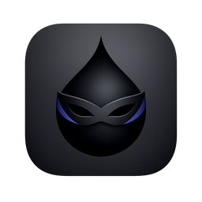

<p align="center">
  
</p>

<h1 align="center">Inkognito</h1>

<p align="center">
  <strong>Your thoughts deserve privacy.</strong><br/>
  A beautiful, local-first markdown notepad that keeps your writing invisible to prying eyes.
</p>

<p align="center">
  <a href="https://github.com/arch-33/inkognito/releases"></a>
  
  
  
</p>

<p align="center">
  
</p>

---

## Why Inkognito?

Most note apps sync your data to someone else's server. Inkognito doesn't. Every word stays on your machine, protected from screen capture and invisible in recordings. Write freely — your journal entries, passwords, drafts, and private thoughts stay private.

---

## Features

### Privacy First
- **Content Protection** — one click hides your notes from screen capture, recordings, and screen sharing
- **Auto-protect on minimize** — your content is automatically shielded when you step away
- **Zero cloud, zero telemetry** — nothing ever leaves your machine

### Beautiful Writing Experience
- **Markdown editor** powered by CodeMirror 6 with syntax highlighting
- **Live preview** with GitHub Flavored Markdown, code highlighting, and Mermaid diagrams
- **Customizable fonts** — Berkeley Mono, JetBrains Mono, Fira Code with ligature support
- **Adjustable font size, line numbers, spell check, and line wrap**

### Organized Your Way
- **Daily notes** — one note per day, always ready
- **Mini calendar** — visual navigation across all your entries
- **Tags** — flexible tagging with autocomplete
- **Favorites** — quick access to the notes that matter most
- **Full-text search** across your entire library

### Thoughtful Details
- **Minimize to tray** — close the window and Inkognito keeps running quietly in your system tray
- **Always-on-top** floating window — pin Inkognito above other apps
- **Adjustable window opacity** — blend into your workflow
- **Custom keyboard shortcuts** — recordable, fully remappable
- **Dark & light themes** with system auto-detection
- **Launch at login** — always within reach
- **Local storage** — fast, reliable, and portable

---

## Install

### macOS (Homebrew)

```bash
brew tap arch-33/tap
brew install --cask inkognito
```

### Download

Grab the latest release for your platform:

| Platform | Download |
|----------|----------|
| macOS (Apple Silicon) | [`.dmg`](https://github.com/arch-33/inkognito/releases/latest) |
| macOS (Intel) | [`.dmg`](https://github.com/arch-33/inkognito/releases/latest) |
| Windows | [`.msi`](https://github.com/arch-33/inkognito/releases/latest) / [`.exe`](https://github.com/arch-33/inkognito/releases/latest) |
| Linux | [`.deb`](https://github.com/arch-33/inkognito/releases/latest) / [`.AppImage`](https://github.com/arch-33/inkognito/releases/latest) |

### Post-install

<details>
<summary><strong>macOS — "App is damaged" or unidentified developer warning</strong></summary>

Since Inkognito is not (yet) notarized with Apple, macOS may block it on first launch. Run this once after installing:

```bash
sudo xattr -dr com.apple.quarantine /Applications/Inkognito.app
```

</details>

<details>
<summary><strong>Windows — SmartScreen warning</strong></summary>

Windows may show a "Windows protected your PC" dialog. Click **More info** → **Run anyway**. This happens because the app is not code-signed yet.

</details>

<details>
<summary><strong>Linux — AppImage permissions</strong></summary>

After downloading the `.AppImage`, make it executable:

```bash
chmod +x Inkognito_*.AppImage
./Inkognito_*.AppImage
```

</details>

---

## Keyboard Shortcuts

All shortcuts are customizable in **Settings > Shortcuts**.

| Action | Default |
|--------|---------|
| Toggle content protection | `⌘⇧H` |
| Toggle float / always on top | `⌘⇧F` |
| Toggle sidebar | `⌘⇧S` |
| Open settings | `⌘,` |
| Toggle edit / preview | `⌘⇧P` |

---

## Tech Stack

| Layer | Technology |
|-------|-----------|
| Framework | [Tauri 2](https://tauri.app) |
| Frontend | React 19, TypeScript, Tailwind CSS 4 |
| Editor | CodeMirror 6 |
| Markdown | react-markdown, remark-gfm, rehype-highlight |
| Diagrams | Mermaid |
| State | Zustand |
| Backend | Rust |
| Build | Vite 8, pnpm |

---

## Development

### Prerequisites

- [Node.js](https://nodejs.org) 22+
- [pnpm](https://pnpm.io)
- [Rust](https://rustup.rs) (stable)
- Platform dependencies for [Tauri 2](https://v2.tauri.app/start/prerequisites/)

### Setup

```bash
# Clone the repo
git clone https://github.com/arch-33/inkognito.git
cd inkognito

# Install dependencies
pnpm install

# Start dev server
pnpm tauri dev
```

### Build

```bash
pnpm tauri build
```

---

## Releasing

Releases are automated via GitHub Actions:

```
GitHub → Actions → Release → Run workflow → Enter version (e.g. 1.2.0)
```

The workflow bumps versions, tags, builds for all platforms, and publishes a GitHub Release.

---

## License

MIT

---

<p align="center">
  <sub>Made with care by <a href="https://github.com/arch-33">arch-33</a></sub>
</p>
